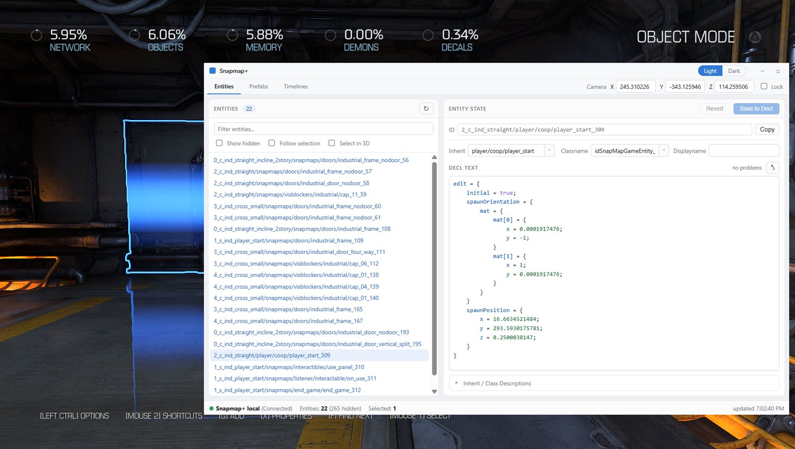
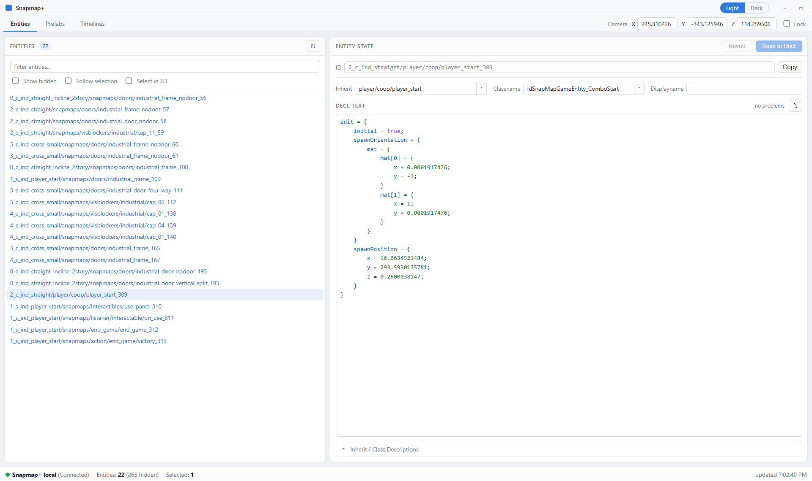
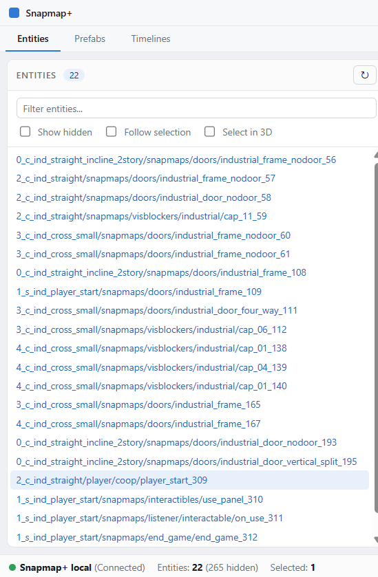
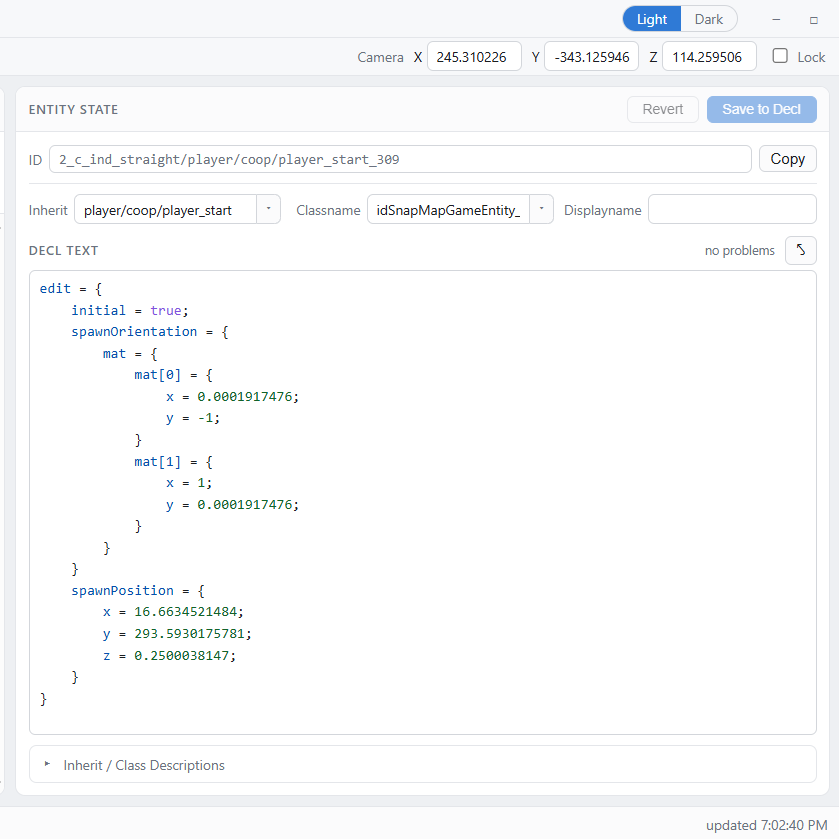
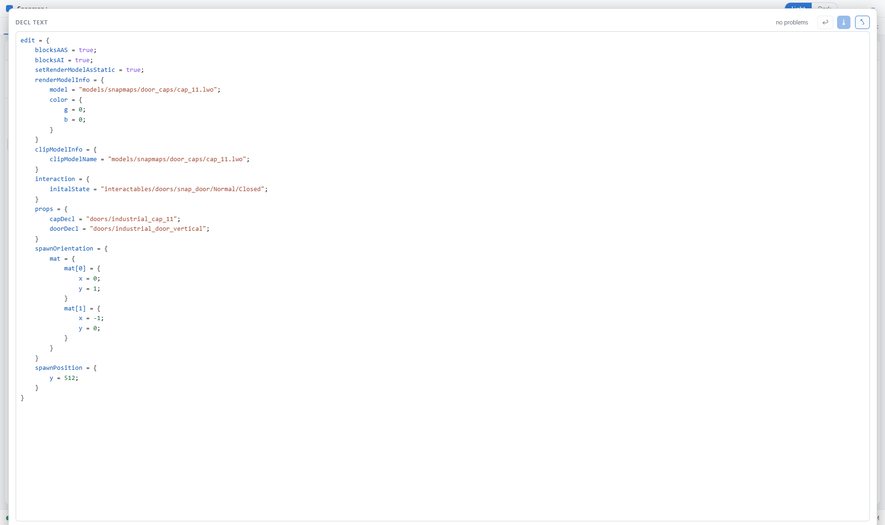
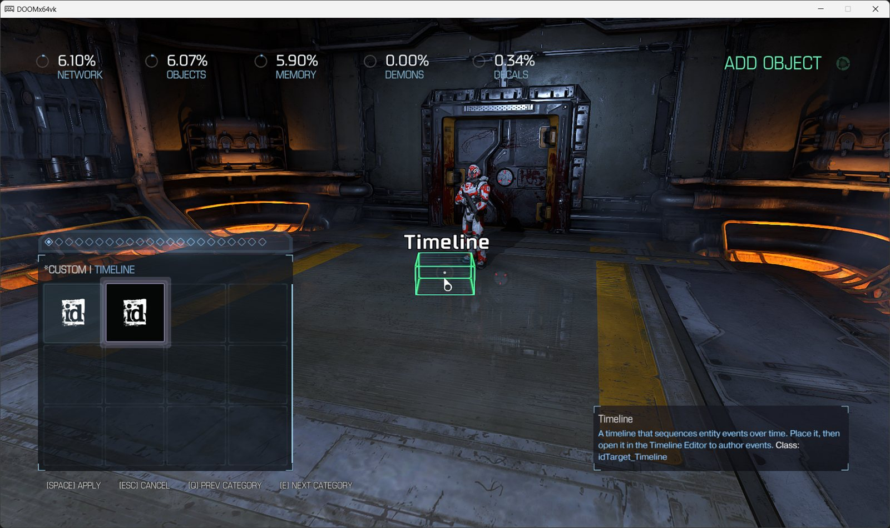
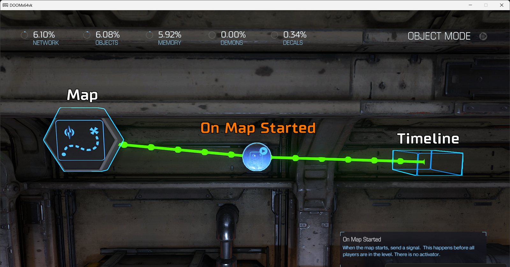
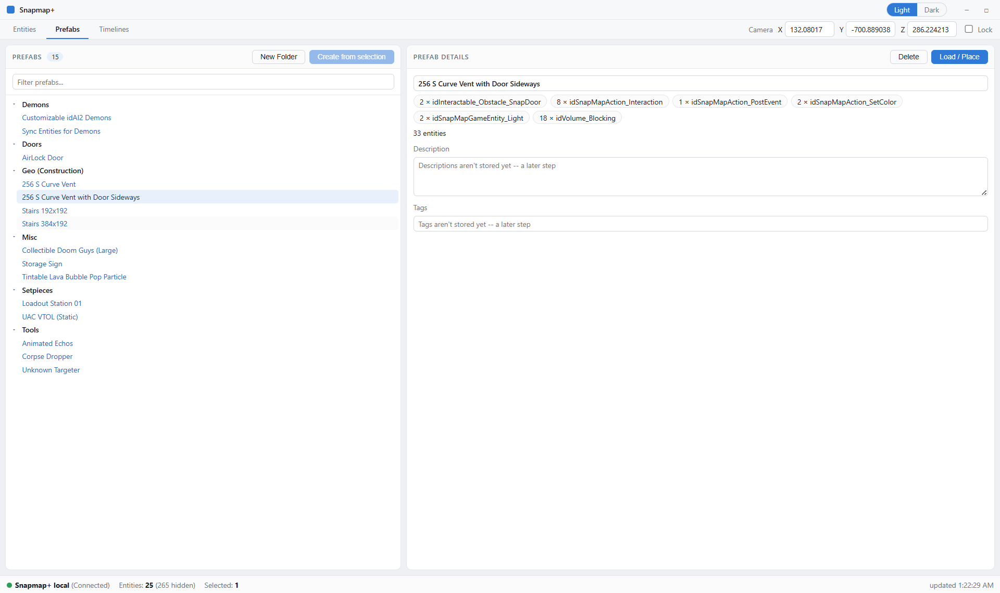
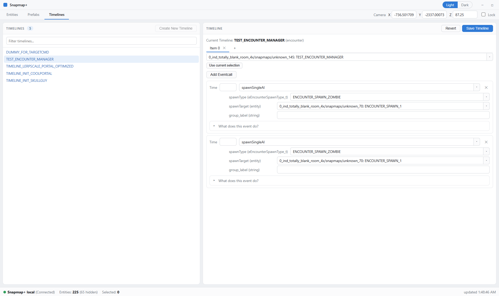

# Guide to Snapmap+

## Table of Contents

- [What is Snapmap+](#what-is-snapmap)
- [Installing Snapmap+](#installing-snapmap)
- [Opening Snapmap+](#opening-snapmap)
- [The Entities Tab](#the-entities-tab)
- [The Entity State Panel](#the-entity-state-panel)
- [Understanding the Decl Format](#understanding-the-decl-format)
- [Common Properties](#common-properties)
- [Reclassing an Entity](#reclassing-an-entity)
- [The Custom Palette Tab](#the-custom-palette-tab)
- [Targets and Logic Signaling](#targets-and-logic-signaling)
- [The Prefabs Tab](#the-prefabs-tab)
- [The Timelines Tab](#the-timelines-tab)
- [Rawmaps](#rawmaps)
- [SnapStack (Bulk Editing)](#snapstack-bulk-editing)
- [Overrides](#overrides)

---

## What is Snapmap+

Snapmap+ is a tool that reads and writes a DOOM (2016) SnapMap file directly, instead of going through
the game's built-in editor UI. That gives you three things the stock editor can't:

- **Properties the Properties menu doesn't expose.** Every entity in DOOM's engine has far more fields
  than SnapMap's UI shows you — Snapmap+ lets you read and write all of them.
- **No editor guardrails.** Name length limits, size limits, and the fixed lists of textures/models/
  effects the Properties menu picks from aren't rules the engine enforces — they're just what the stock
  editor's UI happens to offer. Because Snapmap+ writes the map file directly instead of going through
  that UI, none of those limits apply: you can scale something past the normal max size, or set a texture
  that isn't in SnapMap's own picker at all.
- **Entities SnapMap was never built to place.** The DOOM engine contains far more object types than
  SnapMap's palette exposes. Snapmap+ can place and configure any of them.

Everything Snapmap+ does happens to the **map file itself** — the same file that gets uploaded when you
publish. That means maps built with Snapmap+ work for everyone who plays them, console players included;
nothing needs to be installed on the player's end, and every asset referenced already ships with the base
game.



---

## Installing Snapmap+

### Get the pre-patch DOOM files

Snapmap+ currently targets the DOOM build from **before** the April 2024 patch — the patch changed
enough of the engine's internals that Snapmap+ needs to be rebuilt against it, and that work is ongoing
separately. Until then, you'll need to run DOOM on the previous Steam depot:

1. Press **Windows Key + R**, then enter `steam://nav/console` to open the Steam console.
2. In the Steam console, run:
   ```
   download_depot 379720 379721 2062496009391566631
   ```
3. Once it finishes, find the downloaded files under your Steam folder, typically:
   `C:\Program Files (x86)\Steam\steamapps\content\app_379720\depot_379721`
4. Copy those files into your DOOM install folder (e.g. `C:\Program Files (x86)\Steam\steamapps\common\DOOM`),
   replacing everything when prompted.

Online services (playing and publishing maps) still work on this depot. **Multiplayer/Coop matchmaking
with other players does not** while you're on it.

Running "Verify integrity of game files" in Steam will silently pull you back to the current (patched)
build — if that happens, and you still have the Snapmap+ files installed, remove them first (see below),
verify, then redo the depot-download steps above when you want to go back to editing.

### Install Snapmap+ itself

Download **`snaphak.exe`** from the [Snapmap+ site](./) (or from the project's GitHub Releases page)
and **double-click it**. It finds your DOOM 2016 install automatically by looking through your Steam
libraries, asks you to confirm, and places the overlay. That's the whole install. (`snaphak.exe` is the
short name Snapmap+'s tooling goes by — SnapHak — which you'll also see in its console commands and
folder names.)

A few practical notes:

- **Close DOOM first.** A running game locks the files — the installer detects this and asks you to
  close it rather than failing cryptically.
- If auto-detection can't find DOOM (a non-Steam copy, say), run it from a terminal instead and point
  it at the folder: `snaphak install --doom "C:\path\to\DOOM"`.
- While Snapmap+ is in **beta**, the installer says "No stable release has been published yet" and
  installs the newest beta automatically — nothing extra to do.
- **Already installed?** Double-clicking `snaphak.exe` again shows your installed version, tells you
  when a newer one is available (press Enter to update), and takes any command — `update`, `changelog`,
  `uninstall`, `status` — right there, no terminal needed.
- **Updating later:** run `snaphak update` — it updates both the overlay and `snaphak.exe` itself.
  You never need to re-download anything from the site.
- **Uninstalling:** `snaphak uninstall` restores your DOOM folder to exactly what it was before.
  Your own Snapmap+ data (prefabs, rawmaps, overrides under `%USERPROFILE%\snaphak`) is left untouched.
- `snaphak help` in a terminal lists everything else: `status`, `changelog`, `version`.

What actually lands in your DOOM folder is small: `XINPUT1_3.dll` in the folder itself, and
`snaphakui.dll` inside a `snaphak\` subfolder. Everything is hash-verified before a single file is
touched, and the installer keeps a record so uninstall reverses exactly what it placed.

---

## Opening Snapmap+

Once installed, open a SnapMap in editor mode. A second window — the Snapmap+ panel — will appear
alongside the DOOM window; you'll need to switch windows (Alt+Tab) to see it, since it doesn't overlay
the game.

**Set DOOM's display mode to Windowed or Borderless while you're editing with Snapmap+ — avoid true
Fullscreen.** Snapmap+'s panel is a separate OS window, and switching away from a truly-fullscreen DOOM
window to look at it can crash the game. Borderless and Windowed don't have that problem.

### The window

Snapmap+'s panel has three tabs — **Entities**, **Prefabs**, and **Timelines** — and a couple of controls
that stay visible no matter which tab you're on:



**Light / Dark** (top menu bar) switches the panel's whole color scheme. It doesn't follow your system
theme automatically — pick whichever you prefer.

**Camera Origin** (top-right) shows your editor camera's live X/Y/Z position, and updates continuously
while you move around — handy for finding coordinates to paste into a property. Check **Lock** to pin the
fields (and the camera) in place instead of tracking your movement live; editing a locked field's value
moves the camera there.

---

## The Entities Tab



The Entities tab lists every entity placed in your map, by its **reference ID** and, if you've given it
one, its display name. The list keeps itself up to date automatically as you edit — **Refresh** is there
if you ever want to force an immediate re-sync yourself.

- **Filter entities...** narrows the list by typing part of an ID or name.
- **Show hidden** reveals the entities that exist in every map by default (the built-in filters like "any
  player" / "any AI", etc.) — left unchecked, those are hidden so the list stays focused on what you
  actually placed.
- **Follow selection** makes the list track whatever you have selected in the SnapMap 3D editor — select
  something in-game, and its row (and the Entity State panel) update to match. Turn it off if you'd
  rather browse the list independently of what's selected in-game.
- **Select in 3D** — the reverse direction: selecting a row (or rows) here also selects the matching
  entity in the SnapMap 3D editor.
- **Deselect** clears whatever's selected in the 3D editor. Occasionally clicking off an object in-game
  doesn't fully deselect it — this button is a reliable way to force it.

Right-clicking one or more selected rows gives you:

- **Copy ID** — copies the reference ID(s) to your clipboard, for pasting into another entity's property
  (e.g. a `targets` list — see [Targets and Logic Signaling](#targets-and-logic-signaling)).
- **Delete** — deletes the entity(ies), the same as doing it in-game, but remotely.
- **Push to stack 0** — adds the entity(ies) to SnapStack's scratch stack 0 (see
  [SnapStack](#snapstack-bulk-editing)).
- **Clear stack 0** — empties stack 0 out, regardless of what's currently selected.

Entities that ship as part of the map's module (rather than ones you placed yourself) also show up in
this list — editing or deleting those isn't permanent; they reset the next time the map reloads. If you
need one gone for good, deleting it directly won't stick — instead, signal it (via a `targets` list, or a
Timeline) to a Remove node/command.

---

## The Entity State Panel

Selecting an entity (in the list, or in-game with Follow Selection on) opens its **Entity State** panel
on the right.



- **ID** — the entity's reference ID, read-only, with a **Copy** button.
- **Inherit** and **Classname** — together, these determine what *kind* of entity this is (see
  [Reclassing an Entity](#reclassing-an-entity)). Each has a dropdown of known values, but you can also
  type a value that isn't listed.
- **Displayname** — the name shown in the SnapMap editor and in the Entities list (not shown to players
  in-game). Editing it here bypasses the editor's character limit, and works even on entities the stock
  editor won't let you rename (filters, for instance).
- **Decl Text** — the entity's full underlying declaration, in the format described in
  [Understanding the Decl Format](#understanding-the-decl-format). This is the same data the Properties
  menu edits a slice of — here you see and can edit all of it. Syntax is colorized as you type, and
  anything the checker flags (an unknown property, a value that doesn't look like the type it expects, an
  enum value outside the known set) shows up as an underline plus a count in the corner — **hover a
  warning to jump to it**. A count of "no problems" doesn't guarantee the map will load — the checker
  catches likely mistakes, it doesn't validate everything the engine does.
- **Focus mode** (the expand icon next to the problem count) — expands the decl editor to fill the
  window, hiding the fields above and below it, for distraction-free editing of a long decl. Save,
  Revert, and the problem count stay right there next to the toggle; press **Esc** or click the icon
  again to leave.
- **Save to Decl** — commits your edits (**Ctrl+S** works as a shortcut while the decl editor has focus).
  Most visual changes won't appear in the 3D editor until you reload the map (copy-pasting the entity, or
  playing the map, will reflect the change immediately even without a reload). **You still need to save
  the map itself from SnapMap's own menu** — Save to Decl only writes the change into the in-memory map
  the editor is holding.
- **Revert** — discards your unsaved edits, reloading the entity's last-saved state.
- **Inherit / Class Descriptions** (collapsible, below the editor) — a short description of what the
  current inherit and classname actually are, when Snapmap+ has one on file.



---

## Understanding the Decl Format

The Decl Text editor uses the same syntax the engine itself uses to store entities, so it's worth
learning the shape of it before you start editing.

A property is written as `propertyName = value;` on its own line — the semicolon matters; a missing one
can produce an error when the map loads. A value that's text (a file path, an entity ID) needs quotes:

```
propertyName = "some/file/path";
```

Many properties are themselves a nested group of sub-properties, wrapped in braces:

```
scale = {
    x = 64;
    y = 64;
    z = 64;
}
```

Nesting can go arbitrarily deep — indentation is optional, but keeping it consistent makes it much
easier to keep track of which brace closes which. If your braces don't balance (a `{` with no matching
`}`, or vice versa), the map will fail to load. Everything for the entity needs to sit inside the
outermost `edit { ... }` block. If you accidentally duplicate a property, only the last copy of it
survives a save.

Some properties are **lists**, using a slightly different shape:

```
renderModels = {
    num = 3;
    item[0] = "models/mapobjects/snapmaps/box_trigger.lwo";
    item[1] = "models/mapobjects/snapmaps/dynamic_block_solid.lwo";
    item[2] = "models/mapobjects/snapmaps/dynamic_block_textured.lwo";
}
```

`item[N]` entries are the list's contents, numbered from 0; `num` is the count. **Keep `num` accurate** —
too low, and Save to Decl will silently drop the out-of-range items; too high, and the game can crash
when you try to play the map. You can freely add or remove items as long as you keep `num` matching.

A couple of things to keep in mind while editing:

- Most visual changes won't show up in the 3D editor until you reload the map, copy-paste the entity,
  or play the map — the underlying data is correct immediately, the editor's live view just doesn't
  refresh itself.
- Custom materials specifically don't preview in the editor at all except on Blocking Volumes — you'll
  need to play the map to see how one actually looks, or temporarily apply it to a Blocking Volume if
  you want an in-editor preview.

---

## Common Properties

A handful of properties come up constantly:

**model** (inside `renderModelInfo`) sets what an entity looks like, referencing a model file path.
Works on any entity.

```
renderModelInfo = {
    model = "zion/characters/monsters/lostsoul/base/lostsoul.md6";
}
```

**scale** is a size multiplier on the model — `2` doubles it, decimals between 0 and 1 shrink it, and a
negative value on one axis flips the model. This goes further than the in-game Size field for Blocking
Volumes: you're not limited to whole numbers or the in-game max size.

**customMaterial** re-textures the entire model with the material specified:

```
renderModelInfo = {
    model = "models/snapmaps/props/hell/monster_skull_01.lwo";
    customMaterial = "textures/snapmaps/hotspots/ind_panels_steel";
}
```

There are many more properties beyond these — most Snapmap+ users end up picking them up from community
references and experimentation, since there isn't a single authoritative list.

---

## Reclassing an Entity

Every entity has an **inherit** and a **classname**. Changing either — or both — turns one type of
entity into another.

**classname** determines the entity's actual type in the engine, and what properties are meaningful for
it. **inherit** determines what default values it starts from, and how the entity behaves while you're
still in the editor. The two have to agree with each other — a classname/inherit mismatch is a reliable
way to crash the map.

**Props are the safest thing to reclass.** They have no placement or rotation restrictions, and they
don't carry hidden properties left over from a different entity type that could conflict with the type
you're converting to.

```
Inherit:   snapmaps/volume/blocking
Classname: idVolume_Blocking
```

A worked example — turning a prop into a Mover (a scriptable-movement entity):

1. Change **Classname** to `idMover`
2. Change **Inherit** to `snapmaps/func/snap_lift`
3. Save to Decl
4. Save the map and exit the editor
5. Re-open the map

Change both fields, then save — changing one and saving before the other is exactly the mismatch that
crashes the map.

---

## The Custom Palette Tab

Some entities exist in the DOOM engine but have no resource file made for SnapMap, so there's nothing to
put in **inherit** for them. Snapmap+ handles this with a generic `snapmaps/unknown` inherit that's
compatible with any classname — no mismatch risk, regardless of what type you're setting up.

Rather than making you build one of these by hand every time, Snapmap+ seeds two ready-to-place starting
points — **Unknown** and **Timeline** — directly into DOOM's own Create menu, under a **"*Custom"** tab.



Drop either one in like any other object, then reclass it from there (see
[Reclassing an Entity](#reclassing-an-entity)) if you want a specific engine type rather than a bare
Unknown. If no model is set, an Unknown entity shows as a wireframe box in the editor — that box never
appears in the actual game, it's an editor-only placeholder.

Steps to reclass one manually, if you're not starting from the *Custom tab:

1. Change **Classname** to the type you want.
2. Change **Inherit** to `snapmaps/unknown`.
3. Save to Decl — only after **both** fields are changed, not one at a time, or the map will likely
   crash from the momentary mismatch.
4. Save the map, exit, and re-open it (or copy-paste the entity and delete the original).

---

## Targets and Logic Signaling

Every entity in the engine can have a `targets` list — this is a lower-level version of the signal
system SnapMap's own logic nodes are built on top of. Adding an entity to another's `targets` list has
the same effect as drawing a SnapMap logic line between them:

```
targets = {
    item[0] = "1_ind_totally_blank_room_4x/snapmaps/unknown_3923";
    num = 1;
}
```

What happens when the signal arrives depends on what's receiving it. Signaling an FX or a light directly
toggles it on/off. Entities with a classname starting `idTarget_` do something more specific when
signaled — `idTarget_Damage` deals custom damage to everything in its own `targets` list,
`idTarget_DummyFire` fires a projectile at them, and so on; think of these as the engine-level version of
SnapMap logic Inputs like "Spawn Object" or "Start Timer".

Because `targets` and SnapMap's own logic system both drive the same underlying signal, you can mix
them: add a `targets` list to a SnapMap logic **output** (On Spawned, On Entered, On Used...) or a
**filter** (Player Filter, Boolean Filter...), and firing that output/filter also signals whatever's in
the list — letting your normal SnapMap logic reach entities that aren't SnapMap logic nodes at all.

**`sh_target_any`** (a DOOM console command — press **~** to open the console) is a second way to wire
this up, without touching decl text at all.
While it's toggled on, entities that would normally need a `targets` list become valid endpoints for the
native wire tool — so you can drag a wire from a logic node straight to one, the same way you'd wire two
ordinary SnapMap logic nodes together, instead of typing an ID into a `targets` list by hand. Run
`sh_target_any` again to turn it back off and return to normal SnapMap logic wiring.



---

A lot more becomes possible once you're editing raw decls directly -- turning entities into Movers
(scripted movement/rotation), universal entity spawners, Particle Emitters, custom-animated models, and
binding entities together so they move as one. That's engine-level territory rather than a Snapmap+ UI
feature as such, so it's covered separately rather than here.

---

## The Prefabs Tab



The Prefabs tab saves a group of entities so you can reuse it later, or share it with someone else
running Snapmap+.

**Creating one:** select the entities in the SnapMap editor, then click **Create from selection**. Give
it a name, and it's added to the list. **Your cursor must be hovering one of the selected objects when
you do this** — whichever object that is becomes the one centered on your cursor when you later paste
the prefab back in.

**Using one:** select a prefab in the list to see its details on the right — its name, and (once those
fields are wired up) a description and tags. Click **Load / Place** to stage the prefab for placement
with SnapMap's built-in paste function, then switch to the editor and press **Ctrl+V** to actually drop
it into the map.

**Organizing:** **New Folder** creates a folder you can drag prefabs into; **Filter prefabs...** narrows
the list by name. Selecting a prefab and clicking **Delete** removes it permanently.

Prefabs are stored as individual files under `%USERPROFILE%\snaphak\prefabs\` — sharing one is just
sending someone that file; they drop it into their own `prefabs` folder (or the matching subfolder, to
land it in the same folder on their end) and it shows up in their list. You can drop a file into that
folder from Windows while Snapmap+ is already running — no restart needed, it picks the new prefab up
right away.

---

## The Timelines Tab

A **Timeline** is a single entity that can run multiple scripted actions, on multiple other entities, at
the same or staggered times. Timelines are painful to set up by hand in the raw decl text, so Snapmap+
gives them a dedicated editor.



**Getting a Timeline into your map:** place one from the **\*Custom** palette tab (see
[The Custom Palette Tab](#the-custom-palette-tab)) — this is the reliable way to do it, since it comes
with a valid module location already baked in. It's worth giving each Timeline a unique **Displayname**
so you can tell them apart in the list.

Once it's placed, it shows up here automatically — find it in the list and double-click to open it in the
editor on the right.

A Timeline is organized into **entity events** and **eventcalls**. For every entity you want to script,
you add one entity-event tab; under that tab, you add one eventcall per script you want to run on that
entity.

- The **+** tab adds a new entity-event tab, labeled **Item N** (matching the underlying decl's own
  `item[N]` numbering).
- **Runs on** picks which entity that tab's eventcalls apply to — type an ID, pick from the dropdown, or
  select the entity in the SnapMap editor and click **Use current selection** (exactly one entity must be
  selected for that to work).
- **Add Eventcall** appends a new, blank script call under the current tab.
- Each eventcall has a **Time** (milliseconds of delay between the Timeline firing and this eventcall
  running — can be left blank) and an event/script name — type to search, or pick from the dropdown. Once
  a script is picked, its specific parameters appear below it as proper typed fields (a checkbox for a
  boolean, a coordinate row for a vector, a constrained dropdown for a decl/enum reference) — unlike Time,
  every one of these needs a value, or you'll hit errors.
- **What does this event do?** (collapsible, under a configured eventcall) gives a short explanation of
  the selected script, when one's on file.
- **Save Timeline** commits your edits to the Timeline entity. As with any other entity, **you still need
  to save the map itself** from SnapMap's own menu afterward. **Revert** discards local edits and re-reads
  the Timeline as it currently exists on the map.

A Timeline isn't a native SnapMap logic node, so signaling it only works through
[Targets](#targets-and-logic-signaling) — either by adding its ID to another entity's `targets` list
directly, or by turning on `sh_target_any` and wiring it up with the native wire tool.

---

## Rawmaps

With Snapmap+ running, saving a map also writes a **rawmap** — a full, human-readable copy of the map's
contents — to `%USERPROFILE%\snaphak\rawmap.json`. It's saved automatically on every save; no separate
step needed. A few things it's useful for:

- Sharing a map with another Snapmap+ user without publishing it, or without either of you needing to be
  connected to the game's servers.
- Keeping your own permanent backups, stored wherever you like.
- Updating an already-published map from *any* of your saves, instead of being limited to the one save
  you originally published from.
- Editing the map file directly in a text editor.

**To load a rawmap into the editor:** open the console (**~**) and run `snapHak_rawmaps_on`. Whatever
map you open next (an existing save, to overwrite it, or a blank template) loads from `rawmap.json`
instead of its own saved data. Once it's loaded, open the console again and run `snapHak_rawmaps_off`.

A `rawmap.json` from someone else works the same way — drop it into your own `snaphak` folder (replacing
your own `rawmap.json`) and load it in with `snapHak_rawmaps_on` as above.

---

## SnapStack (Bulk Editing)

**SnapStack** lets you edit many entities at once from the **DOOM console** (press **~** to open it),
instead of one at a time through the Entity State panel. Every command starts with `sh`.

### The stack/group model

Most SnapStack commands work against a **stack** — a scratch list of entities, numbered (stack 0 is the
default) — or a **group**, a *named* list that (unlike a stack) doesn't get cleared out after you use it.
Groups are what you want for running several edits against the same set of entities without reselecting
them each time.

- `sh psel [stack]` — takes your current in-game selection and pushes it onto a stack (default stack 0).
  De-selects everything in-game once it's stored, and reports how many entities landed in which stack.
  Right-clicking a row in the Entities tab and choosing **Push to stack 0** does the same thing for that
  one entity.
- `sh phov [stack]` — pushes whatever entity you're currently hovering (not necessarily selected) onto a
  stack. Pushing the same one twice doesn't duplicate it.
- `sh pr [stack] [lo] [hi]` — pushes every valid id in the inclusive range `lo..hi` onto a stack, without
  needing to select any of them first.
- `sh pg [name] [stack]` — pushes a named group's ids onto a stack (`sh pg [name]` alone targets stack 0)
  — the reverse direction of `pop2g` below.
- `sh pop2g [stack] [name]` — moves a stack's contents into a named group (replacing that group's
  previous contents, if any).
- `sh popsel [stack or group]` — re-selects, in-game, everything stored in a stack or group. Useful both
  for finding something you can only see in the Entities list, and for pulling a group's contents back
  into a stack you can run other commands against.
- `sh cstk [stack]` — empties a stack out. (Right-clicking in the Entities tab and choosing **Clear stack
  0** does the same thing for stack 0 specifically.)

### Narrowing a stack

Once a stack has entities in it, you can filter it down before running an edit — useful when a selection
(or a range/group) contains more than what you actually want to change:

- `sh filtinh [stack] [inherit]` — keeps only the stacked entities whose **inherit** matches.
- `sh filtcls [stack] [classname]` — keeps only the stacked entities whose **classname** matches.

### Bulk-edit commands

All of these take `[stack or group]` first, then more arguments, and (when a stack is used) clear that
stack once they run:

| Command | What it sets |
|---|---|
| `sh bsi [stack/group] [property path] [value]` | An integer property |
| `sh bsf [stack/group] [property path] [value]` | A float/decimal property |
| `sh bsb [stack/group] [property path] [value]` | A boolean property (`true`/`false`) |
| `sh bss [stack/group] [property path] "[value]"` | A string property (quote the value) |
| `sh bsin [stack/group] [inherit path]` | The **inherit** of every entity in the stack/group |
| `sh bscls [stack/group] [classname]` | The **classname** of every entity in the stack/group |
| `sh bsincls [stack/group] [inherit] [classname]` | Both inherit and classname together, safely (no momentary mismatch) |
| `sh bse [stack] [property path]` | Sets a string/reference property on every OTHER entity in the stack to the ID of the LAST entity selected before `sh psel` |
| `sh accl [stack]` | Pops the LAST entity selected before `sh psel` as a receiver, and reference-assigns every OTHER entity in the stack onto it |
| `sh acctargets [stack]` | Appends every OTHER entity in the stack to the `targets` list of the LAST entity selected before `sh psel` |

`[property path]` uses dots for nested properties — `clipModelInfo.size.x`, `renderModelInfo.color.r`,
and so on, the sub-property you want to change written last. Get `inherit`/`classname` wrong together
(with `bsin`/`bscls` alone rather than `bsincls`) and you risk the same mismatch crash as reclassing a
single entity by hand — see [Reclassing an Entity](#reclassing-an-entity).

`bse`, `accl`, and `acctargets` all need to know which entity was selected *last* — since groups don't
track that, those three only work against a stack.

One more, a bit different from the rest: **`sh mkcmd [stack]`** synthesizes a reusable command-entity
macro out of everything currently in a stack, rather than editing a property on each entity directly.

### A few worked examples

**Retexture a group of objects at once:**
```
(select the objects to receive the property)
sh psel
sh bss 0 renderModelInfo.customMaterial "material/snapmap/dynamic_block_solid"
```

**Bind several objects to a mover, all at once, with rotation:**
```
(select the objects to bind, not the mover)
sh psel
sh pop2g 0 binds
sh bsb binds bindInfo.bindOriented true
sh popsel binds
(select the mover)
sh psel
sh bse 0 bindInfo.bindParent
```

**Wire one entity to signal several others via `targets`, quickly:**
```
(select the entities that should be signaled)
(then also select the entity that will do the signaling — last)
sh psel
sh acctargets 1
```

### New in Snapmap+

A few extra commands beyond the original SnapStack set, for inspecting stacks/groups directly instead of
guessing what's in them:

| Command | What it does |
|---|---|
| `sh chkstk [N]` | Inspect stack `N` (ids + id-strings); omit `N` to summarize every non-empty stack. |
| `sh chkgrp [name]` | Inspect a group's ids; omit `name` to list every group and its count. |
| `sh clrgrp <name>` or `sh clrgrp *` | Delete a named group entirely (`*` deletes all of them). |
| `sh snapstack_diag` | Diagnostic: reports which SnapStack implementation is currently handling commands. |

---

## Overrides

**Overrides** are Snapmap+'s way of soft-modding the game — replacing resource files at launch, while
Snapmap+ is running, without touching anything that affects actual gameplay for players who load your
map (a gameplay-affecting override wouldn't travel with the map anyway, so there's no point using one for
that). For Snapmap+ itself, overrides remove editor-side restrictions and save you from typing out edits
by hand that would otherwise be tedious.

The [Custom palette tab](#the-custom-palette-tab) — the Unknown and Timeline entities available straight
from DOOM's own Create menu — is itself built on this system: it's an override that ships with Snapmap+
by default.

To add your own, place files under `%USERPROFILE%\snaphak\overrides\`, matching the path/filename of the
resource you want to replace — the same folder the built-in overrides live in.

Actually authoring an override's *contents* is a separate skill from placing the file — the format
depends entirely on which resource you're replacing, and isn't covered in this guide.

